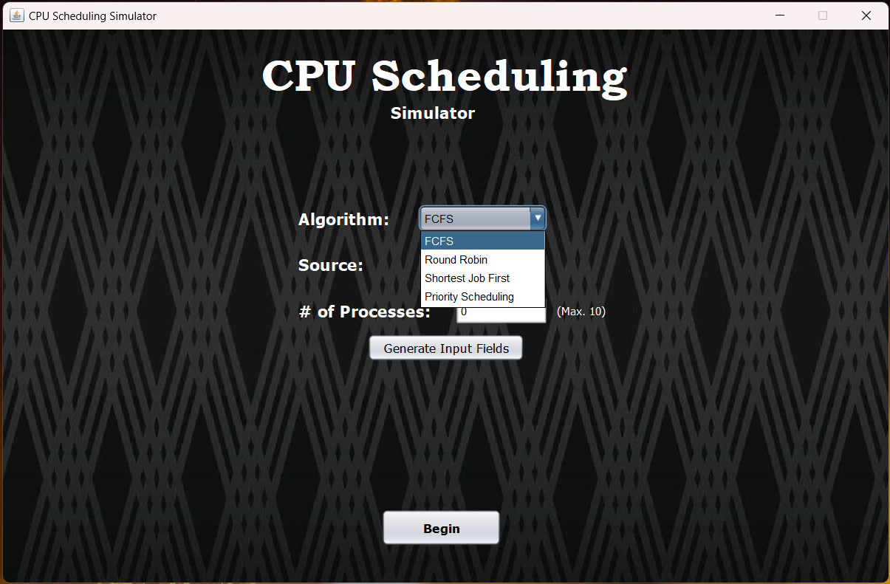
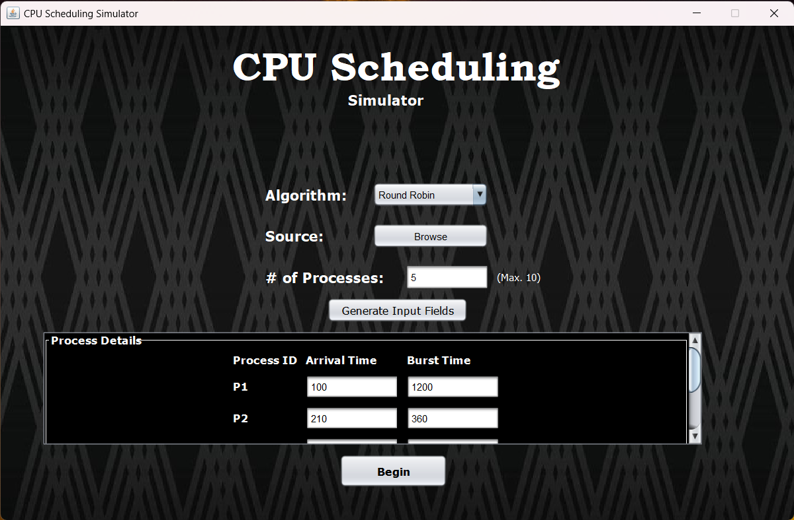
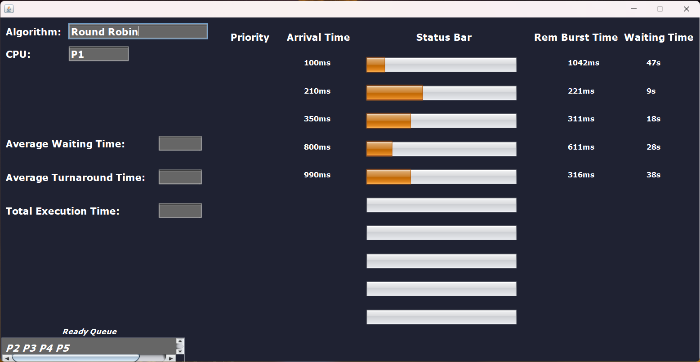
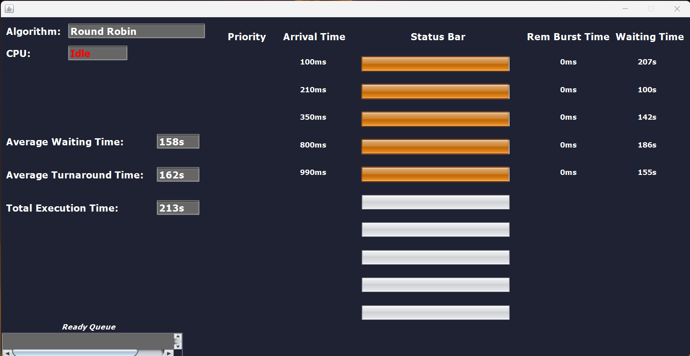

### cpu scheduling scheduler

algorithms available:
1. FCFS
2. Shortest Job First
3. Round Robin Scheduling
4. Priority Scheduling

how to use?
1. cd main/
2. compile the 'SchedulerGUI.java' file (javac SchedulingGUI.java)
3. execute the 'SchedulerGUI.class' file (java SchedulingGUI)

frame 1:

frame 2:

